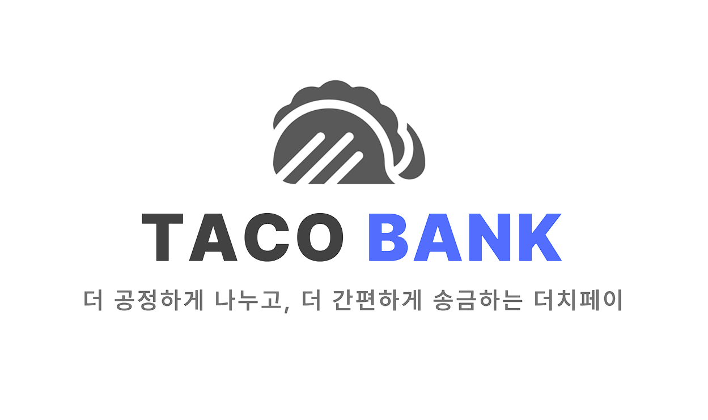
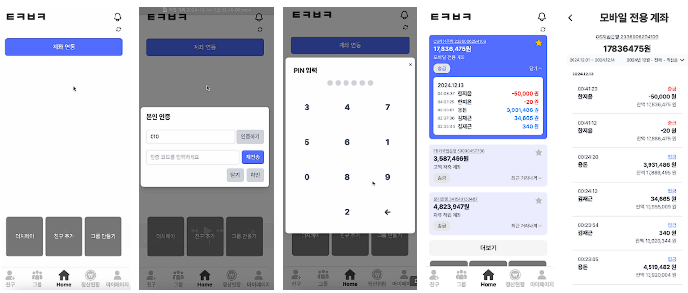
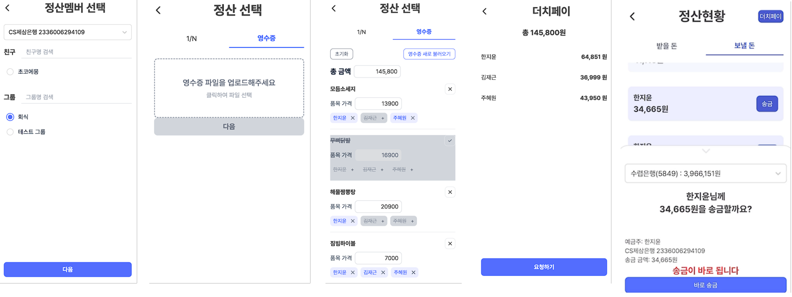
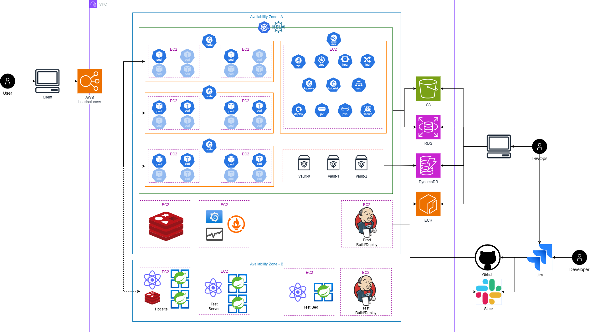

[//]: # (# 0. Getting Started &#40;시작하기&#41;)

[//]: # (```bash)

[//]: # ($ docker compose up -d --build)

[//]: # (```)

[//]: # ([서비스 링크]&#40;https://club-project-one.vercel.app/&#41;)

#  📝 프로젝트 개요
- ### 프로젝트 이름: TacoBank
- ### 프로젝트 설명: 영수증 기반 간편정산 플랫폼

<br/>

# 💁‍♂️ 팀원
|                    Backend/TL                    |                     DevOps                     |                  Frontend                   |                  Backend                   |
|:------------------------------------------------:|:----------------------------------------------:|:-------------------------------------------:|:------------------------------------------:|
|  |  |  |  |
|      [한지윤](https://github.com/Koreanpaper)       |      [김재근](https://github.com/klolarion)       |      [엄선호](https://github.com/ho0116)       |      [주혜원](https://github.com/hywnj)       |
<br/>


# 💻 주요 기능
- **회원가입**:
    - 회원가입 시 DB에 유저정보가 등록됩니다.

- **로그인**:
    - 사용자 인증 정보를 통해 로그인합니다.

- **통합계좌연동**:
    - SMS인증 후 테스트베드 오픈뱅킹 API를 호출하여 사용자의 계좌정보를 받아올 수 있습니다.

- **친구/그룹 관리**:
    - 이메일로 친구를 검색하고 추가/삭제/차단/승인 할 수 있습니다.
    - 정산할 친구들과 일회성/다회성 그룹을 생성할 수 있습니다.

- **일반 송금**:
    - 연동된 계좌에서 대상 계좌로 송금할 수 있습니다.

- **영수증 기반 정산**:
    - 영수증 사진을 인식하여 각 품목별 리스트를 만들고, 품목별 정산인원을 넣거나 뺄 수 있습니다.
    - 품목을 제외하거나 가격을 수정할 수 있습니다.

- **일반 정산**:
    - 금액을 기준으로 1/N 정산을 진행할 수 있습니다.

- **간편 송금**:
    - 내가 받은 정산 요청을 클릭하면 등록된 PIN번호 입력 후 바로 송금할 수 있습니다.

<br/>

# 📱 주요 화면 구성




<br/>

# 🚧 작업 및 역할 분담
|     |                                                  |                                                                                                 |
|-----|--------------------------------------------------|-------------------------------------------------------------------------------------------------|
| 한지윤 |  | <ul><li>통합 계좌 및 거래내역 조회</li><li>일반 더치페이 로직</li><li>친구/그룹 기능</li></ul>                           |
| 김재근 |    | <ul><li>시스템 아키텍처 설계</li><li>서비스 배포 및 운영 관리</li><li>프로젝트 인프라 구축</li><li>테스트베드 API서버 개발</li></ul> |
| 엄선호 |       | <ul><li>UI/UX</li><li>프론트 개발</li></ul>                                                          |
| 주혜원 |        | <ul><li>인증서버 개발</li><li>송금 및 영수증 더치페이 기능</li><li>문자 인증 기능</li></ul>                             |

<br/>

# ⚙ 기술 스택

### Front-end


### Back-end


### Infra


### Tools


### API


<br/>

# 🛠️ 프로젝트 아키텍처


<br/>

# 📦 프로젝트 구조 
```plaintext
# 실제 개발 및 배포는 멀티Repo 형태로 진행

project/
├── frontend/                # 프론트
├── backend/
│   ├── auth                 # 인증서버
│   └── core                 # 코어서버
├── docs/                    # 각종 프로젝트 문서
└── README.md                # 프로젝트 개요
```

<br/>

# 🤹‍♀️ 개발 워크플로우
## 브랜치 전략 

- main Branch
  - 배포 가능한 상태의 코드를 유지합니다.
  - 모든 배포는 이 브랜치에서 이루어집니다.

- dev Branch
  - 기능 개발 브랜치입니다.
  - 모든 기능 개발은 이 브랜치에서 이루어집니다.
  - 개발과 로컬테스트가 완료되면 작업내용을 테스트 브랜치로 전달합니다.

- test Branch
  - 배포 전 통합 테스트 브랜치입니다.
  - 테스트서버에 배포되며 QA가 진행됩니다.

- TACO-{넘버링}-{작업내용} Branch
    - 팀원 각자의 개발 브랜치입니다.
    - Jira를 통해 생성되며 작업 후 dev/test 브랜치로 병합된 뒤 삭제됩니다.


## 테스트 전략
- 로컬 테스트: 개발자 관점에서 기능 테스트 
- E2E 테스트: 사용자 관점에서 전체 흐름 검증
<br/>


